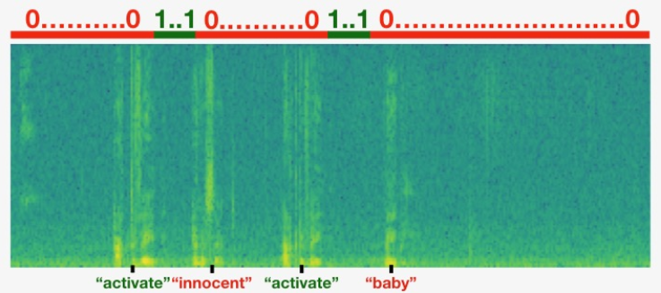

# Trigger-word-detection
This model inspired by Coursera deep learning online program. it is about trigger word detection, aka. wake/hot word detection. Like when you yell at Amazon Alexa or Google Home to wake them up. but it would be cool to do real time testing with your machine and start linking the model to another model (voice assistant model for example), so that's what are we trying to do.

For the sake of simplicity, let's take the word "Activate" as our trigger word. 

The training dataset needs to be as similar to the real test environment as possible. For example, the model needs to be exposed to non-trigger words and background noise in the speech during training so it will not generate the trigger signal when we say other words or there is only background noise.

As you may expect training a good speech model requires a lot of labeled training samples. Do we just have to record each audio and label where the trigger words were spoken? Here is a simple trick to solve this problem.

We generate them!

First, we have 3 types of audio recordings,

1. Recordings of different backgrounds audios. They might just as simple as two clips of background noise, 10 seconds each, coffee shop, and living room.

2. Recordings of the trigger word "activate". They might be just you speaking the word 10 times in different tones, 1 second each.

3. Recordings of the negative words. They might be you speaking other words like "baby", "coffee", 1 second for each recording.

Here is the step to generate the training input audio clips,

- Pick a random 10-second background audio clip 
- Randomly overlay 0-4 audio clips of "activate" into this 10sec clip
- Randomly overlay 0-2 audio clips of negative words into this 10sec clip

We choose overlay since we want to mix the spoken words with the background noise to sounds more realistic.

For the output labels, we want it to represent whether or not someone has just finished saying "activate".

We first initialize all timesteps of the output labels to "0"s. Then for each "activate" we overlayed, we also update the target labels by assigning the subsequent 50 timesteps to "1"s.

Why we have 50 timesteps "1"s?

Because if we only set 1 timestep after the "activate" to "1", there will be too many 0s in the target labels. It creates a very imbalanced training set.

It is a little bit of a hack to have 50 "1" but could make them a little bit easy to train the model. Here is an illustration to show you the idea.

For a clip which we have inserted "activate", "innocent", activate", "baby." Note that the positive labels "1" are associated only with the positive words.

The green/blueish plot is the spectrogram, which is the frequency representation of the audio wave over time. The x-axis is the time and y-axis is frequencies. The more yellow/bright the color is the more certain frequency is active (loud).

Our input data will be the spectrogram data for each generated audio. And the target will be the labels we created earlier.

Without further due, let's take a look at the model structure.

he 1D convolutional step inputs 5511 timesteps of the spectrogram (10 seconds), outputs a 1375 step output. It extracts low-level audio features similar to how 2D convolutions extract image features. Also helps speed up the model by reducing the number of timesteps.

The two GRU layers read the sequence of inputs from left to right, then ultimately uses a dense+sigmoid layer to make a prediction. Sigmoid make the range of each label between 0~1. Being 1, corresponding to the user having just said "activate".

